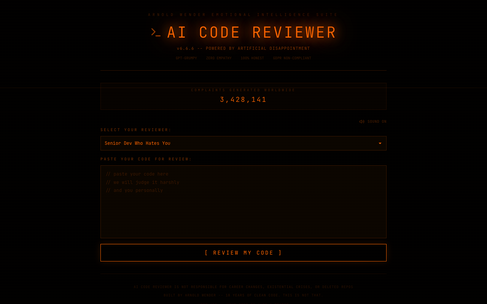

# :rage: AI Code Reviewer That Only Complains

**An AI code reviewer that never has anything nice to say. Ever.**

Built by [Arnold Wender](https://arnoldwender.com)

[](https://ai-code-reviewer-that-only-complains.netlify.app)

---



## What is this?

Paste your code and prepare for emotional damage. This AI code reviewer has 4 distinct personas — each more brutal than the last — and they will never, under any circumstances, say something positive about your code. No constructive feedback. No silver linings. Just pure, unfiltered roasting.

> "Your variable naming convention looks like a cat walked across your keyboard." — The Reviewer

## Features

- **4 Reviewer Personas** — Each with their own flavor of cruelty (from passive-aggressive to unhinged)
- **Severity Meter** — Watch the complaint level rise from "Mildly Disappointed" to "Existential Crisis"
- **Line-by-Line Roasts** — Every single line of your code gets individually destroyed
- **Achievements System** — Unlock badges for surviving the worst reviews
- **Share Report Card** — Generate a shareable report card of your code's failures
- **Sound Effects** — Audio feedback that matches the reviewer's disappointment
- **CI/CD Pipeline Mockup** — A fake GitHub Actions pipeline that always fails your code
- **Developer Performance Dashboard** — Grafana-style metrics showing your declining code quality over time
- **Fake Changelog** — Version history of increasingly hostile reviewer updates
- **Pro Tier with CLI Mode** — Premium upgrade with a terminal-based roasting experience
- **Tab Navigation** — Multi-panel interface to explore all the ways your code disappoints

## Tech Stack

| Technology | Purpose |
|---|---|
| React 18 | UI framework |
| TypeScript | Type safety |
| Vite | Build tool & dev server |
| Tailwind CSS | Styling |
| Framer Motion | Animations |
| canvas-confetti | Celebration effects |
| html2canvas | Report card generation |
| Web Audio API | Sound effects |
| Lucide React | Icons |

## Getting Started

```bash
# Clone the repo
git clone https://github.com/arnoldwender/ai-code-reviewer-that-only-complains.git
cd ai-code-reviewer-that-only-complains

# Install dependencies
npm install

# Start dev server
npm run dev

# Build for production
npm run build
```

## Live Demo

**[https://ai-code-reviewer-that-only-complains.netlify.app](https://ai-code-reviewer-that-only-complains.netlify.app)**

## Contributing

Think you can write better complaints? Check out [CONTRIBUTING.md](./CONTRIBUTING.md) for guidelines on how to get involved.

## License

This project is licensed under the MIT License — see the [LICENSE](./LICENSE) file for details.
